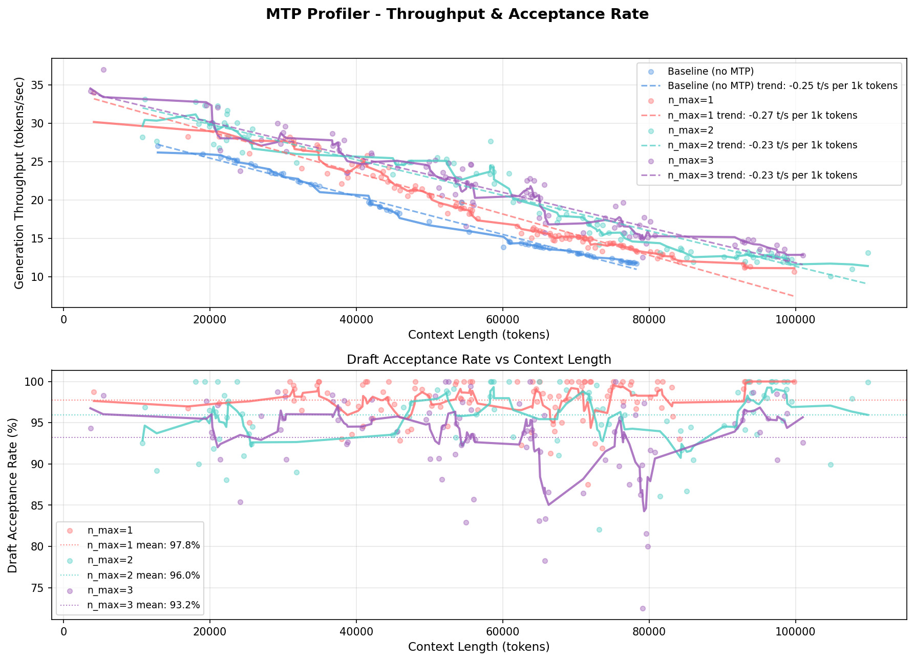
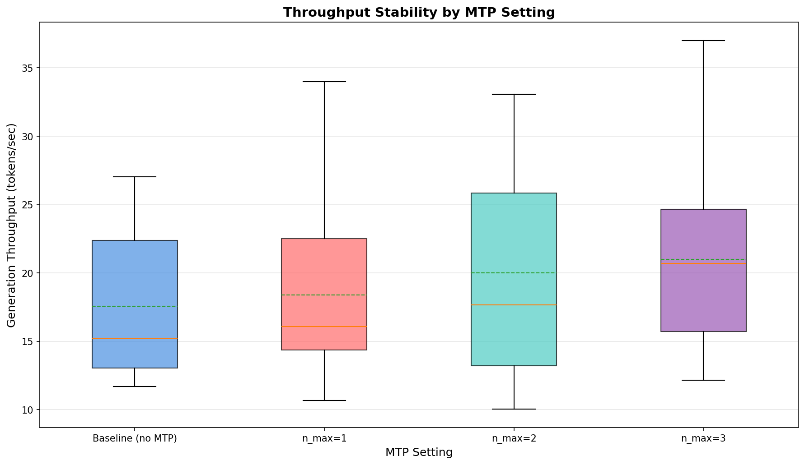
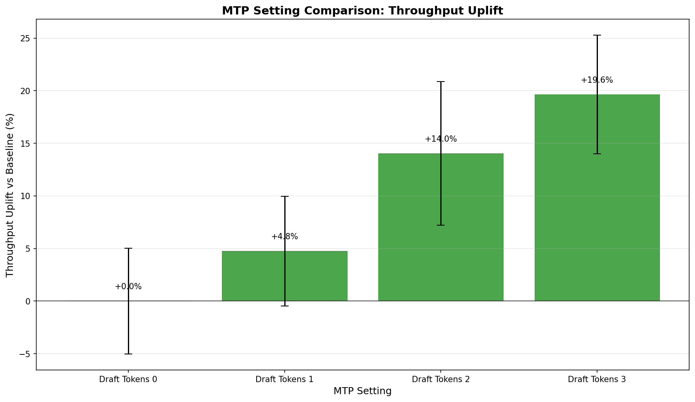

# MTP Profiler

Profile speculative decoding / Multi-Token Prediction (MTP) performance in llama.cpp inference workloads on Apple Silicon systems.

Analyze real-world inference logs to determine the optimal MTP draft-token setting for your specific hardware and workload.

## Features

- **Passive log analysis** - No synthetic benchmarks, just analyze real llama.cpp server logs
- **Cross-run merging** - Multiple runs with the same MTP setting are merged into one dataset
- **Multi-run detection** - Detects server restarts and separates runs automatically
- **Apple Silicon aware** - Collects chip type, memory, memory pressure, and thread information
- **Deterministic recommendations** - Algorithmic scoring with diminishing returns penalty
- **Publication-quality charts** - Throughput vs context, acceptance rates, stability boxplots
- **LOWESS smoothing** - Optional advanced smoothing for trend lines
- **MTP internal stats** - Parses draft call counts, generation/acceptance durations
- **Robust parsing** - Tolerates ANSI codes, malformed lines, truncated logs

## Installation

```bash
cd mtp-profiler
python -m venv .venv
source .venv/bin/activate
pip install -e .
```

## Quick Start

### Full pipeline (recommended)

```bash
mtp-profiler profile llama.log -d output/
```

This runs all stages automatically:
1. **Parse** - Extract telemetry from the log file
2. **Analyze** - Compute throughput stats, correlations, MTP comparisons
3. **Recommend** - Generate optimal MTP setting recommendation
4. **Plot** - Generate charts in `output/charts/`

### Step-by-step

```bash
# Stage 1: Parse log
mtp-profiler parse llama.log -o parsed.json

# Stage 2: Analyze
mtp-profiler analyze parsed.json -o analysis.json

# Stage 3: Recommend
mtp-profiler recommend analysis.json -o recommendation.json

# Stage 4: Plot
mtp-profiler plot analysis.json -d charts/
```

### Multi-run analysis

If your log contains multiple server restarts (different MTP configurations), the default behavior merges all runs by `n_max` setting, showing one line per unique setting. To analyze a specific run:

```bash
mtp-profiler profile llama.log -d output/ -r run_2
```

Or analyze all runs by specifying the run ID for each stage.

## Output

The `profile` command produces:

```
output/
├── parsed.json          # Raw extracted telemetry
├── analysis.json        # Computed metrics
├── recommendation.json  # Optimal MTP setting
└── charts/
    ├── throughput_and_acceptance.png  # Throughput + acceptance rate charts
    ├── stability_boxplot.png          # Throughput distribution by setting
    └── uplift_vs_baseline.png         # Throughput uplift comparison
```

### Example Charts

Below are example outputs from profiling `Qwen3.6-35B-A3B-UD-Q4_K_XL` on Apple M3 Pro (28753 MB, 8/11 threads).

#### Throughput & Acceptance Rate



Each line represents a different MTP `n_max` setting, with all runs for the same setting merged into one dataset. The top subplot shows generation throughput vs context length, the bottom shows draft acceptance rate.

#### Stability Boxplot



Shows the distribution of generation throughput for each MTP setting, making it easy to spot unstable configurations.

#### Throughput Uplift vs Baseline



Compares each MTP setting's average throughput against the baseline (no MTP), with error bars showing standard deviation.

### Recommendation output

```
============================================================
  MTP Profiler - Recommendation
============================================================
Recommended MTP setting: 3

Settings compared:
  Setting 0: throughput=+0.0%, long-context=degraded, stability=variable
  Setting 1: throughput=+4.8%, long-context=degraded, stability=variable
  Setting 2: throughput=+14.0%, long-context=degraded, stability=variable
  Setting 3: throughput=+19.6%, long-context=degraded, stability=variable <-- recommended

Throughput vs baseline: +19.6%
Long-context efficiency: degraded
Stability: variable
Average generation throughput: 19.37 t/s
Average draft acceptance rate: 95.7%
============================================================
```

## Data Model

### Parsed output structure

```json
{
  "runs": [
    {
      "id": "run_1",
      "metadata": {
        "model": "Qwen3.6-35B-A3B-UD-Q4_K_XL.gguf",
        "quantization": "Q4_K_XL",
        "system": {
          "chip": "Apple M3 Pro",
          "chip_type": "M3",
          "unified_memory_mb": 28753,
          "cpu_threads": 8,
          "cpu_total_threads": 11
        },
        "mtp_config": {"n_max": 1, "n_min": 0, "p_min": 0.7}
      },
      "measurements": [
        {
          "n_tokens": 62557,
          "n_decoded": 278,
          "generation_tokens_per_second": 15.65,
          "prompt_tokens_per_second": 193.36,
          "draft_acceptance_rate": 0.975,
          "n_drafts_generated": 447,
          "n_drafts_accepted": 415
        }
      ]
    }
  ]
}
```

### Measurement fields

| Field | Description |
|-------|-------------|
| `n_tokens` | Context length (tokens) |
| `n_decoded` | Number of decoded tokens |
| `generation_tokens_per_second` | Generation throughput |
| `prompt_tokens_per_second` | Prompt processing throughput |
| `draft_acceptance_rate` | MTP draft acceptance rate (0-1) |
| `n_drafts_generated` | Number of drafts generated |
| `n_drafts_accepted` | Number of drafts accepted |
| `truncated` | Number of truncated tokens |
| `mtp_calls` | Number of MTP inference calls |
| `mtp_gen_drafts` | Drafts generated by MTP |
| `mtp_acc_drafts` | Drafts accepted by MTP |
| `mtp_gen_tokens` | Tokens generated by MTP |
| `mtp_acc_tokens` | Tokens accepted by MTP |
| `mtp_dur_batch` | Batch processing duration (ms) |
| `mtp_dur_gen` | Generation duration (ms) |
| `mtp_dur_acc` | Acceptance duration (ms) |

## Analysis Metrics

The analyze stage computes:

- **Throughput statistics** - avg, std, min, max, median, p10, p90 generation TPS
- **Context-TPS correlation** - Pearson correlation between context length and throughput
- **Degradation rate** - TPS loss per 1000 tokens of context
- **MTP setting comparisons** - Grouped by `n_max` setting with context ranges
- **Stability metrics** - Coefficient of variation, variance
- **Long-context behavior** - Short vs long context TPS ratio

## Recommendation Scoring

The recommendation engine uses a weighted scoring algorithm:

| Factor | Weight | Description |
|--------|--------|-------------|
| Throughput | 40% | Average generation TPS |
| Stability | 25% | Low coefficient of variation |
| Long-context efficiency | 20% | TPS ratio (long/short context) |
| Acceptance rate | 15% | Average draft acceptance rate |
| Diminishing returns | Penalty | Deducts points for n_max > 2 |

## Architecture

```
mtp_profiler/
├── cli/              # Typer CLI with subcommands
├── models/           # Pydantic data models
├── parser/           # llama.cpp log parser
├── analyzer/         # Analysis engine
├── visualizer/       # Chart generation
├── recommender/      # Deterministic recommendation engine
└── system_info/      # Apple Silicon detection
```

## CLI Reference

### `parse`

Extract telemetry from llama.cpp server logs.

```bash
mtp-profiler parse <log_file> [-o OUTPUT] [-v]
```

### `analyze`

Compute derived metrics from parsed data.

```bash
mtp-profiler analyze <input.json> [-o OUTPUT] [-r RUN_ID] [-v]
```

### `recommend`

Generate MTP setting recommendations.

```bash
mtp-profiler recommend <analysis.json> [-o OUTPUT] [-v]
```

### `plot`

Generate publication-quality charts.

```bash
mtp-profiler plot <analysis.json> [-d OUTPUT_DIR] [-r RUN_ID] [--lowess] [--lowess-frac FRAC] [-v]
```

Use `--lowess` for smoother trend lines (requires `statsmodels`):

```bash
pip install -e ".[lowess]"
mtp-profiler plot analysis.json --lowess --lowess-frac 0.33
```

### `profile`

Full pipeline: parse → analyze → recommend → plot.

```bash
mtp-profiler profile <log_file> [-d OUTPUT_DIR] [-r RUN_ID] [-v]
```

### `sysinfo`

Display system information.

```bash
mtp-profiler sysinfo
```

## Requirements

- Python 3.11+
- Apple Silicon (M1/M2/M3)
- llama.cpp server logs

Optional:

- `statsmodels` - Required for LOWESS smoothing (`pip install -e ".[lowess]"`)

## Development

```bash
# Install in development mode
pip install -e ".[dev]"

# Install with LOWESS smoothing support
pip install -e ".[dev,lowess]"

# Run tests
pytest tests/ -v

# Run with real log
mtp-profiler profile llama.log -d test-output/
```

## Future Extensibility

v1 is intentionally focused on llama.cpp log analysis. The architecture supports future extensions:

- LM Studio / Ollama / Open WebUI support
- Synthetic benchmark harnesses
- Live monitoring
- Adaptive runtime MTP recommendations

## License

MIT
